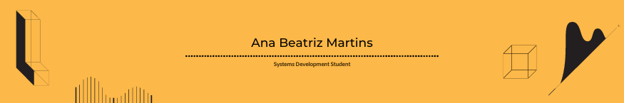

 <h2>👉About me:</h2>
 
<ul>
    <li>🌱I'm a 16 year old student;</li>
    <li>🌟I'm in the 2nd year of Technical High School in Systems Development;</li>
    <li>📚I'm more interested in Front-End;</li>
    <li>🧩I'm currently learning React Native.</li>
  </ul>

 

 <h2>👉Contacts:</h2>

     <h4>Discord: Anabe#0935</h4>  
 

 
  

<a href="https://github.com/anabmartins">

 

  
 <h2>👉I'm currently learning:</h2>
  &nbsp;
  &nbsp;
  &nbsp;
  &nbsp;
  &nbsp;
  &nbsp;
  &nbsp;
  &nbsp;
  &nbsp;
  <!--&nbsp;-->
  
  
